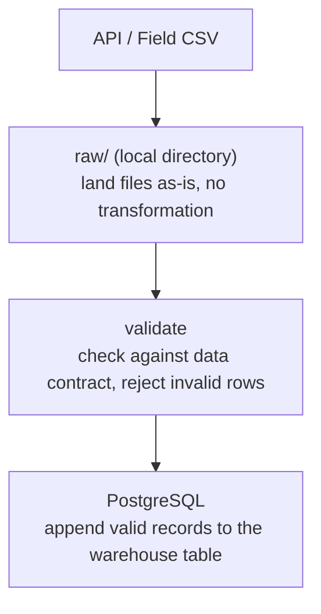

# Chapter 01: Data Ingestion

> **Ready to dive in?** See [setup.md](setup.md) for infrastructure setup.

## Context

GreenVault has been operating for several years before hiring a Data Engineer. During that time, field agents manually collected commodity prices by visiting local markets, calling traders, and copying from public notice boards. Those prices were recorded in spreadsheets - the only price history GreenVault has.

Recently, an external agricultural API started publishing daily market prices for the regions GreenVault operates in. Your job is to:

1. **Migrate** GreenVault's historical field-collected price records into the warehouse - a one-time full load
2. **Build a daily pipeline** that fetches new prices from the API and appends them going forward - an incremental load

Field agents are not going away. When the API is unavailable, agents still collect prices manually and submit them as CSV. Your pipeline must handle both sources.

---

## Pipeline Overview

Every record - whether from the API or a field agent CSV - follows the same two-step flow before reaching the warehouse:



Raw files are never modified. If a load fails after landing, you can re-process from raw without re-fetching from the source.

---

## Learning Objectives

By the end of this chapter you will know how to:

1. **Distinguish full load from incremental load** - when to use each and why
2. **Land raw data before transforming** - why separating ingestion from loading matters
3. **Execute a full load** - migrate a historical flat file into a warehouse table, handling messy real-world data
4. **Validate against a data contract** - reject records that fail schema or constraint checks in the pipeline, not the database
5. **Execute an incremental load** - fetch from an API and append only new records
6. **Handle ingestion failures** - recover gracefully when a data source is unavailable
7. **Ensure idempotency** - re-running the pipeline for the same date range must not create duplicates

---

## The Two Load Patterns

### Part 1: Full Load - Historical Migration

GreenVault's historical prices live in a CSV exported from spreadsheets. This is a one-time migration into the warehouse.

The data is field-collected: some dates and markets may be missing, formatting is inconsistent, and there is no guarantee of uniqueness.

### Part 2: Incremental Load - Daily API Pipeline

Once the historical data is loaded, the API takes over. Each day, the pipeline fetches the latest prices and appends them to the warehouse.

The API serves the last 30 days of data. Each day produces new records; old records never change.

---

## API

The API runs locally at `http://localhost:8000`. Interactive docs are at `http://localhost:8000/docs`.

| Endpoint             | Description                        |
|----------------------|------------------------------------|
| `/market-prices`     | Market prices for a given date     |
| `/v2/market-prices`  | Market prices (v2)                 |
| `/weather`           | Weather conditions for a given date|
| `/v2/weather`        | Weather conditions (v2)            |
| `/health`            | Health check                       |

All endpoints accept a `date` query parameter (ISO8601, e.g. `2026-05-08`) and an optional `market` filter. See `/docs` for full request/response schemas and possible error codes.

---

## Data Contract

All market price records - whether from the API or a field agent CSV - must conform to this contract. Validation happens in the pipeline, not the database.

| Field            | Type     | Required | Constraints                  |
|------------------|----------|----------|------------------------------|
| `commodity_id`   | string   | Yes      | Non-empty, predefined values |
| `commodity_name` | string   | Yes      | Non-empty                    |
| `market_id`      | string   | Yes      | Non-empty, predefined values |
| `unit`           | string   | Yes      | Always `"kg"`                |
| `unit_price_ngn` | float    | Yes      | Must be > 0                  |
| `recorded_at`    | ISO 8601 | Yes      | Valid timestamp              |

**Allowed commodities:** `cassava_dried`, `maize_dried`, `beans`, `yam`, `groundnuts`, `millet`, `sorghum`, `rice`

**Allowed markets:**

| Market ID         | Region      |
|-------------------|-------------|
| `lagos_lekki`     | South Coast |
| `makurdi_central` | Middle Belt |
| `jos_main`        | Middle Belt |
| `kaduna_central`  | Middle Belt |
| `kano_central`    | North       |

> The historical CSV may contain records that fail this contract. That is expected - validate, reject invalid rows, and log them.

---

## Target Schema

```sql
CREATE TABLE market_prices (
    commodity_id   TEXT,
    commodity_name TEXT,
    market_id      TEXT,
    unit           TEXT,
    unit_price_ngn NUMERIC,
    recorded_at    TIMESTAMPTZ,
    source         TEXT,
    ingested_at    TIMESTAMPTZ
);
```

No constraints are enforced at the database level. Data quality is the pipeline's responsibility. The `source` column records where each row came from (`api` or `field_csv`).

---

## Domain Context

### Why Prices Vary

- **Seasonality:** harvest season drives prices down (high supply); off-season drives them up
- **Regional variance:** same commodity trades at different prices across regions due to transport costs, storage, and local demand
- **Dried crops:** commodities like `cassava_dried` and `maize_dried` can be stored, which dampens seasonal swings compared to fresh produce

### Seeding and Reproducibility

API prices are deterministically generated from date + market + commodity. The same date always produces the same prices across all learners, so bugs are reproducible and results are comparable.

---

## Done When

### Part 1 - Full Load

- [ ] Historical data is in `market_prices` in PostgreSQL
- [ ] Re-running the migration produces the same result

### Part 2 - Incremental Load

- [ ] The pipeline runs end-to-end across the last 30 days without manual intervention
- [ ] Re-running the pipeline for the same date range produces the same result
