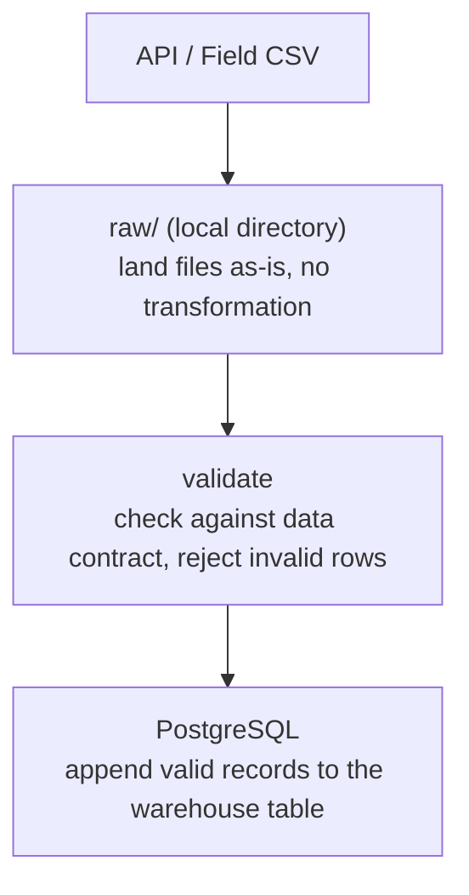

# Chapter 01: Data Ingestion

> **Ready to dive in?** See [setup.md](setup.md) for infrastructure setup.

## Context

GreenVault has been operating for several years before hiring a Data Engineer. During that time, field agents manually collected commodity prices by visiting local markets, calling traders, and copying from public notice boards. Those prices were recorded in spreadsheets — the only price history GreenVault has.

Recently, an external agricultural API started publishing daily market prices for the regions GreenVault operates in. Your job is to:

1. **Migrate** GreenVault's historical field-collected price records into the warehouse — a one-time full load
2. **Build a daily pipeline** that fetches new prices from the API and appends them going forward — an incremental load

Field agents are not going away. When the API is unavailable, agents still collect prices manually and submit them as CSV. Your pipeline must handle both sources.

---

## Pipeline Overview

Every record — whether from the API or a field agent CSV — follows the same two-step flow before reaching the warehouse:



Raw files are never modified. If a load fails after landing, you can re-process from raw without re-fetching from the source.

---

## Learning Objectives

By the end of this chapter you will know how to:

1. **Distinguish full load from incremental load** — when to use each and why
2. **Land raw data before transforming** — why separating ingestion from loading matters
3. **Execute a full load** — migrate a historical flat file into a warehouse table, handling messy real-world data
4. **Validate against a data contract** — reject records that fail schema or constraint checks in the pipeline, not the database
5. **Execute an incremental load** — fetch from an API and append only new records
6. **Handle ingestion failures** — fall back to a field-collected CSV when the API is unavailable
7. **Ensure idempotency** — re-running the pipeline for the same date range must not create duplicates

---

## The Two Load Patterns

### Part 1: Full Load — Historical Migration

GreenVault's historical prices live in a CSV exported from spreadsheets. This is a one-time migration: land the file in `raw/`, validate each record, and load what passes into PostgreSQL.

**Characteristics of this dataset:**

- Field-collected — some dates and markets may be missing
- Inconsistent formatting — values may fall outside expected ranges
- No guarantee of uniqueness — the same date/market/commodity may appear more than once

Your full load must:

- Land the raw CSV in `raw/` before any processing
- Validate each record against the data contract in the pipeline
- Reject and log invalid records — do not halt on bad data
- Truncate the warehouse table before loading (this is a full replace)
- Be re-runnable without producing duplicates

### Part 2: Incremental Load — Daily API Pipeline

Once the historical data is loaded, the API takes over. Each day, the pipeline fetches the latest prices, lands them in `raw/`, and appends valid records to the warehouse.

**Characteristics of this source:**

- Structured and consistent — conforms to the data contract
- Append-only — each day produces new records, old records never change
- Occasionally unavailable — fall back to field agent CSV when the API returns errors

Your incremental load must:

- Land the raw response in `raw/` before any processing
- Fetch only new dates — do not re-fetch dates already in the warehouse
- Fall back to the field agent CSV when the API is unavailable for a date
- Validate before loading — invalid records are rejected in the pipeline, not the database
- Be idempotent — re-running for the same date must not create duplicates

---

## API Versions

| Version | Endpoints           | Behaviour                                                          |
|---------|---------------------|--------------------------------------------------------------------|
| v1      | `/market-prices`    | Always succeeds — use while building your pipeline                 |
| v2      | `/v2/market-prices` | ~20% of dates return `503` — use when practising fallback handling |

v2 outages are deterministic — the same date always fails, so bugs are reproducible.

---

## Data Contract

All market price records — whether from the API or a field agent CSV — must conform to this contract. Validation happens in the pipeline, not the database.

| Field            | Type     | Required | Constraints                  |
|------------------|----------|----------|------------------------------|
| `commodity_id`   | string   | Yes      | Non-empty, predefined values |
| `commodity_name` | string   | Yes      | Non-empty                    |
| `market_id`      | string   | Yes      | Non-empty, predefined values |
| `unit`           | string   | Yes      | Always `"kg"`                |
| `unit_price_ngn` | float    | Yes      | Must be > 0                  |
| `recorded_at`    | ISO 8601 | Yes      | Valid timestamp              |

**Allowed commodities:** `cassava_dried`, `maize_dried`, `beans`, `yam`, `groundnuts`, `millet`, `sorghum`, `rice`

**Allowed markets:**

| Market ID         | Region      |
|-------------------|-------------|
| `lagos_lekki`     | South Coast |
| `makurdi_central` | Middle Belt |
| `jos_main`        | Middle Belt |
| `kaduna_central`  | Middle Belt |
| `kano_central`    | North       |

> The historical CSV may contain records that fail this contract. That is expected — validate, reject invalid rows, and log them.

---

## Target Schema

```sql
CREATE TABLE market_prices (
    commodity_id   TEXT,
    commodity_name TEXT,
    market_id      TEXT,
    unit           TEXT,
    unit_price_ngn NUMERIC,
    recorded_at    TIMESTAMPTZ,
    source         TEXT,
    ingested_at    TIMESTAMPTZ
);
```

No constraints are enforced at the database level. Data quality is the pipeline's responsibility. The `source` column records where each row came from (`api` or `field_csv`).

---

## Domain Context

### Why Prices Vary

- **Seasonality:** harvest season drives prices down (high supply); off-season drives them up
- **Regional variance:** same commodity trades at different prices across regions due to transport costs, storage, and local demand
- **Dried crops:** commodities like `cassava_dried` and `maize_dried` can be stored, which dampens seasonal swings compared to fresh produce

### Seeding and Reproducibility

API prices are deterministically generated from date + market + commodity. The same date always produces the same prices across all learners, so bugs are reproducible and results are comparable.

---

## Done When

### Part 1 — Full Load

- [ ] Raw historical CSV is landed in `raw/` before any processing
- [ ] Records failing the data contract are rejected and logged in the pipeline, not the database
- [ ] Valid records are loaded into `market_prices` in PostgreSQL
- [ ] Re-running the migration produces the same result without duplicates

### Part 2 — Incremental Load

- [ ] Raw API response is landed in `raw/` before any processing
- [ ] The pipeline does not re-fetch dates already present in the warehouse
- [ ] When a date returns `503` from the API, the pipeline falls back to the field agent CSV for that date
- [ ] Valid records are appended to `market_prices`
- [ ] Re-running the pipeline for the same date range does not create duplicate rows
