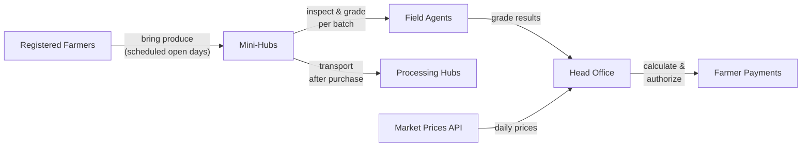

# Data Engineering Mentorship Program

Worked examples covering data engineering design patterns, using a shared local stack and [kroft](https://github.com/JesuFemi-O/kroft) as the data generator.

Based on *[Data Engineering Design Patterns](https://learning.oreilly.com/library/view/data-engineering-design/9781098165826/)* by Bartosz Konieczny.

---

## Who This Is For

Intermediate data engineers who are comfortable with Python and SQL but want structured, hands-on exposure to real-world DE patterns: ingestion, quality, transformation, and beyond.

---

## The Scenario: GreenVault

Throughout this program you will work as a Data Engineer at **GreenVault**, a Nigerian agricultural business that buys and transports produce in bulk from registered farmers across the country.

Here is how the operation works:

- **Registered farmers** bring produce to **mini-hubs** on scheduled open days
- **Field agents** at each mini-hub inspect and grade each batch - checking for stones, spoilage, and overall quality
- Grading is done **per batch**; each farmer is allowed a limited number of batches per open day due to manpower constraints
- Each batch must fall within a **minimum and maximum produce weight**
- Produce is **transported from mini-hubs to processing hubs** after purchase
- Grades are relayed to **head office**, which uses them - alongside current market prices - to calculate and authorize farmer payments



Your job is to build the data infrastructure that makes those decisions reliable, traceable, and scalable.

---

## Prerequisites

- Python 3.11+
- [uv](https://docs.astral.sh/uv/) - for virtual environment and dependency management ([installation guide](https://docs.astral.sh/uv/#installation))
- [Docker](https://docs.docker.com/get-docker/) and Docker Compose - for the local infrastructure stack

---

## Python Setup

1. Create a virtual environment:

```bash
uv venv
```

2. Activate it:

```bash
source .venv/bin/activate  # macOS/Linux
.venv/Scripts/activate     # Windows
```

3. Install dependencies:

```bash
uv sync
```

---

## Structure

```
de-mentorship-program/
├── infrastructure/          # docker-compose stack (grows per chapter)
├── shared/                  # reusable helpers: DB connection, kroft column definitions
├── examples/                # standalone runnable scripts
├── 01_data_ingestion/       # chapter 1
└── ...                      # chapters added as we progress
```

Each chapter folder contains its own `README.md` with the concept, tasks, and setup instructions.

---

## Chapters

| #  | Topic          | Status      | Setup                                                      |
|----|----------------|-------------|------------------------------------------------------------|
| 01 | Data Ingestion | In progress | [01_data_ingestion/README.md](01_data_ingestion/README.md) |
